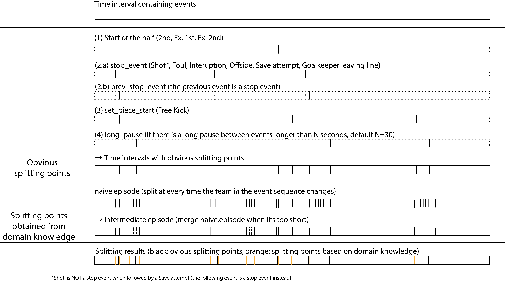

# Data description

## episodes

The episode data is a list of rows, each representing a single event in a match. The columns are as follows:

### Basic information

- `episode`: The episode number, starting from 1 for the first episode of the match.
- `team_name`: The name of the team that the event is associated with.
- `event_name`: The name of the event.
- `match_id`: The match identifier.
- `match_period`: The period of the match in which the event occurred.
- `event_sec`: The time in seconds from the start of the match at which the event occurred.
- `sub_event_name`: The name of the sub-event.
- `main_team`: The name of the team mainly involved in the episode.
- `tags`: A list of tags associated with the event. (for details see [Wyscout's API documentation](https://support.wyscout.com/matches-wyid-events#10-available-tag-ids))
- `id`: The event identifier.
- `player_name`: The name of the player involved in the event.
- `start_x`: The x-coordinate of the event start location. (`[0, 105]`)
- `start_y`: The y-coordinate of the event start location. (`[0, 68]`)
- `end_x`: The x-coordinate of the event end location. (`[0, 105]`)

### Derived information
- `role`: The role of the player in the event, identified by our algorithm.
- `zone_start`: The name of the zone where the event started.
- `zone_end`: The name of the zone where the event ended.
- `playerank_role`: The role of the player in the event, provided by [the original paper](https://www.nature.com/articles/s41597-019-0247-7)'s author.
- `playerank_score`: [The PlayeRank score](https://dl.acm.org/doi/10.1145/3343172) of the player in the event.
- `incorrect_location`: A boolean value indicating whether the event location may be incorrect. (e.g., the goal kick always starts from the pitch corner)

### Additional information used to split the episodes

- `change_of_possession`: A boolean value indicating whether the event is a change of possession.
- `change_of_possession.long_duration`: A boolean value indicating whether the event is a change of possession with a long duration (to consider ping-pong-like situations).
- `start_of_episode`: A boolean value indicating whether the event is the start of an episode (used to calculate `episode` by applying `cumsum` on this column).

#### Obvious indicators of the start of a new episode
- `obvious.<name>`: A boolean value indicating whether the event is an obvious indicator of the start of a new episode.
    - `half_start`
    - `prev_stop_event`
    - `set_piece_start`
    - `long_pause`
- `obvious.start_of_episode`: A boolean value indicating whether the event is the start of an episode (used to calculate `obvious.episode` by applying `cumsum` on this column).
- `obvious.episode`: The episode number calculated by the `obvious.start_of_episode` column.

#### Additional indicators of the start of a new episode obtained using domain knowledge

- `naive.episode`: The episode number when taking every change of the team in possession as the start of a new episode. To be merged to create `intermediate.episode`.
- `intermediate.episode`: The episode number after merging short episodes from `naive.episodes` to the previous episode.

## summary

Summary of the episode data.

- `match_id`: The match identifier.
- `label`: The label of the match.
- `home_id`: The home team identifier.
- `away_id`: The away team identifier.
- `home_score`: The score of the home team.
- `away_score`: The score of the away team.
- `home_scoreET`: The score of the home team after extra time.
- `away_scoreET`: The score of the away team after extra time.
- `home_count`: The number of episodes of the home team.
- `away_count`: The number of episodes of the away team.
- `total_pass`: The total number of episodes in the match.
