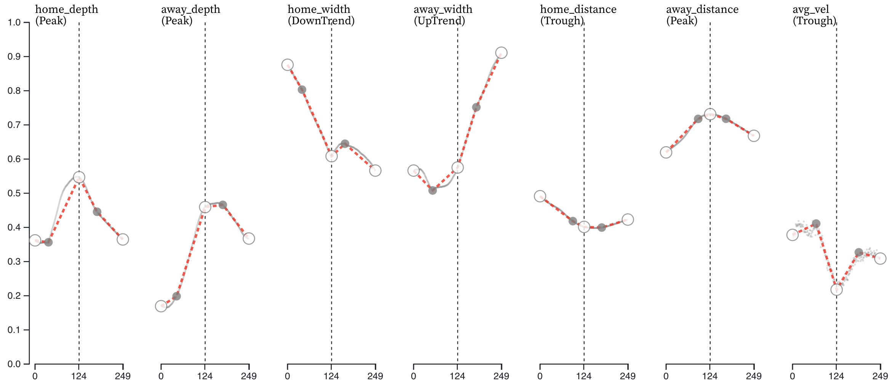
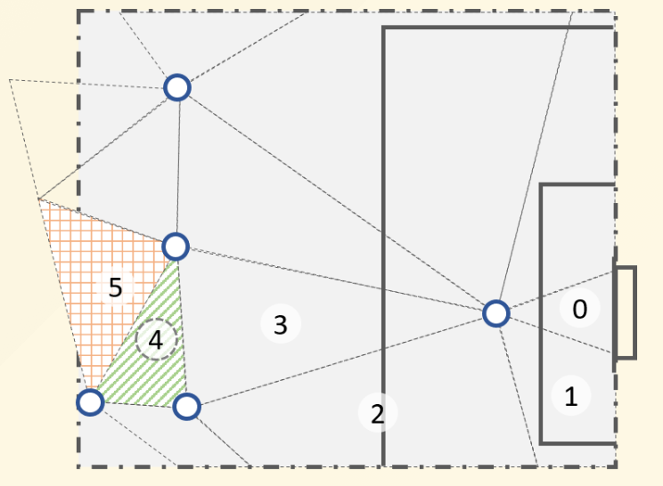

## Principles of Data Mining and Learning Algorithms: Visual Analytics

This page refers to a seminar which took place in the summer semester of 2024. The content is no longer being updated. If you are interested in the content of this seminar, please contact [me](mailto:gota@hey.com) directly.

### Master: MA-INF 4209
---
<figure>
  
  <figcaption>Abstraction of time series episodes</figcaption>
</figure>

In this seminar, we will learn skills and knowledge required for Visual Analytics.

**Our goal** is for you to engage in a learning process to explore the importance of these skills through hands-on tasks and active participation.

**Our targets** during the seminar:

- to enable you to find visual representations that facilitate reasoning with data
- to understand computational methods in visualization
- to develop visual interfaces that aid human interpretation of visually represented data, preferably in an interactive manner.

**As preparation for our first meeting,** please find and bring a couple of real-world examples of visual representations, such as charts, that you find effective in interpreting data. Include a brief summary explaining what you think makes these visualizations useful.

**Prerequisite**: a basic understanding of data visualization tools such as [D3.js](https://d3js.org/) (JavaScript) or [Plotly](https://plotly.com/python/) (Python) is ideal, though familiarity with [Google Spreadsheets](https://newsinitiative.withgoogle.com/resources/trainings/google-sheets-visualizing-data/) is sufficient for participation.

**What you will have to do**: we plan at least one presentation on your development process and a final report on the visual analytics tools you've created. The course will aim to seamlessly blend theoretical concepts with hands-on practice.

---

## Important dates

| Date | Time | Contents |
| ---- |  --- | -------- |
| May 14 (Tue.) | 12:00 - 14:00 | Introduction and Overview |
| May 28 (Tue.) | 12:00 - 14:00 |Understanding phenomena through Visual Analytics |
| June 11 (Tue.) | 12:00 - 14:00 | Developing Visual Analytics tools I |
| June 25 (Tue.) | 12:00 - 14:00 | Developing Visual Analytics tools II |
| July 2 (Tue.) | 12:00 - 14:00 | Developing Visual Analytics tools III |
| July 16 (Tue.) | 12:00 - 14:00 | **Deadline for the final report** |

<figure>
  
  <figcaption>Visualization of "gates" in football</figcaption>
</figure>
---

## Materials

- [Visual Analytics for Data Scientists](https://link.springer.com/book/10.1007/978-3-030-56146-8) (Should be free for Uni Bonn students)

## Useful links

- [Dataviz Inspiration](https://www.dataviz-inspiration.com/)
- [Fundamentals of Data Visualization](https://clauswilke.com/dataviz/index.html)

---

## Registration

Please register for the seminar via:
- the [BASIS website](https://basis.uni-bonn.de/) (**`Informatik, Life Science Informatics und Media Informatics` > `Master Computer Science` > `Intelligent Systems`**)
- the [eCampus page](https://ecampus.uni-bonn.de/goto_ecampus_crs_3268236.html)

---
## Contact
- Gota Shirato ([gshirato@uni-bonn.de](mailto:gshirato@uni-bonn.de))
- MLAI teaching ([https://www.mlai.cs.uni-bonn.de/en/teaching-1/ss2024](https://www.mlai.cs.uni-bonn.de/en/teaching-1/ss2024))